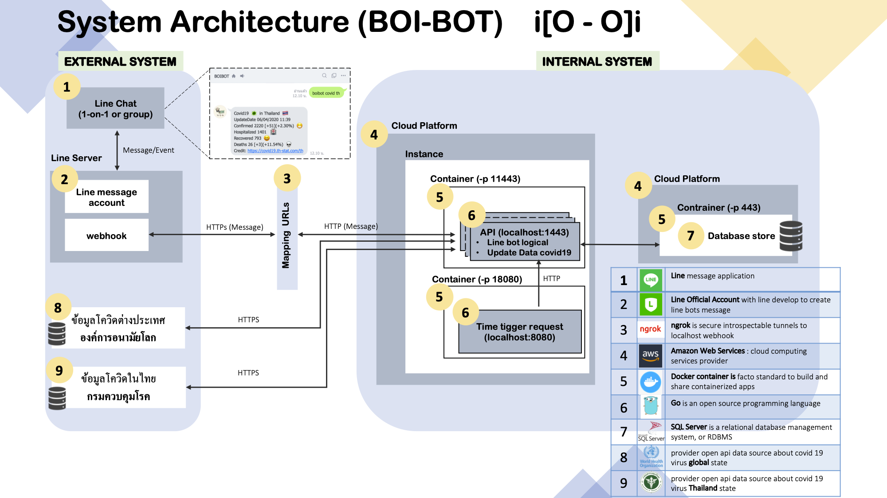

# BOI BOT   i[O - O]i
Line bot API implement by golang & gin framework



#### Implement stack
- Logic coding line message (linebot) : Golang
- API service Golang : Gin Framework
- Store : database type relational microsoftSQL/SQL Server (mssql)
- Container : Docker
- Cloud server : AWS 
- Mapping service to https : ngrok

#### Team delivery task : WFH
- manage task case : Trello
- Version control coding : Gitlab (TODO goal to public repo)
- video Screen&voice call meeting : Dicord 


#### Credit Data source 
- total covid19 state in thailand : <https://covid19.th-stat.com/>
- total covid19 state global root at WHO : <https://thevirustracker.com/>

#### How to install
```
git clone https://gitlab.com/CSBlockchainKmitl/boibot.git
git checkout dev
git pull origin dev

go mod init boibot
go mod vendor
```
#### How to run
```
go run go .
```

## step by step for goal project
1. เก็บ requirement
  - ที่มาความสำคัญที่เกิดเป็นโปรเจค boibot (ปัญหา)
  - วัตถุประสงค์
  - ประโยชน์
  - หาแหล่งอ้างอิงของข้อมูล ว่ามีความน่าเชื่อถือหรือมั้ย จะขอใช้ต้อมูลต้องทำยังไง
2. ออกแบบการทำงานระบบ(การทำงาน`workflow/api spec`&ความสามารถ`func`) ที่ตอบโจทย์ requirement
3. ออกแบบฐานข้อมูล(ER&DB spec) ที่ตอบโจทย์ การทำงานระบบ
4. เริ่ม implement ระบบตาม api spec ความสำคัญของงานอยู่ใต้การดูแลของ PM
    - line message api
    - update data api get covid19 state from root data source update to db

5. build source code` to docker images 
6. push docker images to dockerhub
7. create instance cloud
    - select shopping spec server
    - setting `inbound/outbound`  Security Groups
8. remote to instance ,pull docker images and run docker container
9. **mapping public IP whit https by ngrok
10. copy https://url to line bot webhook
11. test enjoin with boibot in line app :)

** !! why use ngrok to mapping https
- ngrok(have Free Trial)
- line bot webhook : require HTTPS 
- เปิด https and setting domain ไม่ฟรี

## 1-4. Implement
## 5. Docker
## 5.1 Make Dockerfile
- Make new file by cmd : `touch Dockerfile`
- Copy to Dockerfile
```
#Copy to Dockerfile
FROM golang:latest
# Author
MAINTAINER dangminhtruong
# Create working folder
RUN mkdir /app
COPY . /app
WORKDIR /app
```

## 5.2 Docker build images
technology for building and container your applications with env

EX : `docker build -t <dockerhub_id>/<projectname>:latest .` 
 
```
#Docker images
docker build -t jiraponjermkure/boibot:latest . 
docker images
```
see in terminal
```
REPOSITORY                   TAG                    IMAGE ID            CREATED              SIZE
boibot                       latest                 412b6c8394b1        About a minute ago   828MB
```
## 6. Docker push tp dockerHub


## 7. Create new EC2 instance in AWS
1. Login AWS console
2. Shopping server spec :
- OS  : ubuntu v18.09
- CPU : 2 core
- RAM : 2 GB
3. download file.pem is key ssh remote to ec2
4. remote ssh to ec2 by file.pem
5. install environment 
- Docker ce : <https://docs.docker.com/install/linux/docker-ce/ubuntu/>
- jq : 
````

sudo apt install jq
````
6. run docker container
7. test HTTP request

## 8. Remote to instance&Docker run container
** after run cmd in terminal : it auto pull docker images from dockerHub(is public repo)
```
#Docker container
docker run --name boibot -p 11443:1443 -d jiraponjermkure/boibot:latest go run . 
 //My boibot start at 1443 port
docker ps -a
```

**!!`Webhook Linebot : is require url HTTPS`

## 9-10. Mapping Public IP for EC2 to HTTPS by ngrok
mapping `<ip:port>` to https://url random by ngrok(Free Trial)
````
#mapping & run ngrok background print log to file.log
ngrok http 172.31.40.90:11443 > ngrok.log &
````

Copy https://url by ngrok to line bot webhook

EX: `https://cb8ee84d.ngrok.io`
````
#get https://url random by ngrok
curl -s localhost:4040/api/tunnels | jq -r .tunnels[0].public_url
````


## 11.Enjoin with boibot in line app :)

## ngrok (Free Tier)
````
For quick demos and other simple tunneling needs.
HTTP/TCP tunnels on random URLs/ports
1 online ngrok process
4 tunnels/ngrok process
40 connections / minute
````
